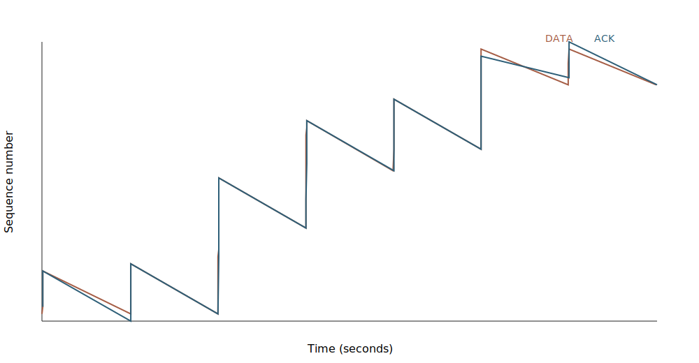

# Reliable Transport over UDP

A selective-repeat-style file transfer protocol built on UDP. The client keeps a configurable window of packets in flight, retransmits timed-out packets, and completes only after every packet has been acknowledged. The server intentionally drops inbound and outbound packets at a configurable rate, reassembles out-of-order data, and supports interleaved transfers from multiple clients.

This project was originally completed for **CSE 156/L: Network Programming** at UC Santa Cruz in Winter 2025. The original university-hosted source was lost when the campus Unix service was retired; this repository is a reconstructed and expanded implementation based on the surviving assignment specification.

## Highlights

- Sliding-window transfer rather than stop-and-wait
- Per-packet acknowledgements and timeout-based retransmission
- Independent simulated loss for received DATA and transmitted ACK packets
- Out-of-order buffering and in-order file reconstruction
- Multiple simultaneous client sessions on one UDP socket
- CRC-32 integrity checking for every protocol datagram
- RFC 3339 CSV logs for DATA, ACK, and DROP events
- Explicit failure codes for an unreachable server and retransmission exhaustion
- Streaming file access: memory use is bounded by the configured window

## Build

```sh
make
```

This creates:

- `bin/myserver`
- `bin/myclient`

## Usage

```sh
./bin/myserver PORT DROP_PERCENT
./bin/myclient SERVER_IP SERVER_PORT MSS WINDOW INPUT_PATH OUTPUT_PATH
```

Example:

```sh
./bin/myserver 9090 10
./bin/myclient 127.0.0.1 9090 512 10 samples/input.bin received/output.bin
```

`MSS` is the maximum UDP datagram size, including the 32-byte protocol header.

## Test

```sh
make test
```

The integration suite covers text, empty, binary, nested-path, and lossy transfers and verifies output integrity with SHA-256.

## Visualize a transfer

```sh
./bin/myclient 127.0.0.1 9090 512 10 input.bin received.bin > client.log
python3 tools/plot_timeline.py client.log timeline.svg
```



The sample timeline was generated from a deterministic transfer with simulated packet loss. Retransmitted DATA points appear at later times while acknowledgements allow the sliding-window base to advance.

See [`doc/protocol.md`](doc/protocol.md) for the packet format and state machine.
